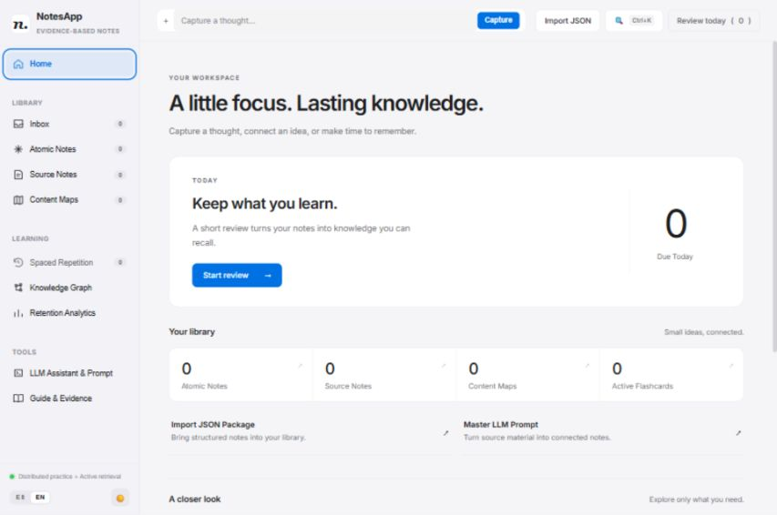

# NotesApp

**Capture ideas. Connect your notes. Remember what you learn.**

NotesApp is a local-first note-taking and spaced-repetition application that runs in your browser and stores your knowledge as Markdown files on your computer. It brings together source notes, atomic ideas, content maps, flashcards, and an interactive knowledge graph.

English is the default interface language. Spanish is available through the **EN / ES** switcher, and both languages have their own import prompt.



## Features

- **Quick capture:** save thoughts to your inbox and organize them later.
- **Source notes:** record references, authors, and key takeaways from what you read or watch.
- **Atomic notes:** explain one idea at a time, connect it with wikilinks, and organize it with folders and tags.
- **Content maps:** group related ideas and explain why each connection matters. Switch between cards and a conceptual matrix.
- **Spaced repetition:** review question-and-answer cards with SM-2 scheduling and topic interleaving.
- **Knowledge graph:** explore connections, search and filter nodes, and inspect related notes.
- **Learning analytics:** view review history, success rates, streaks, card maturity, and upcoming workload.
- **JSON import:** import structured note packages, including flashcards and maps.
- **Exports:** download flashcards for Anki and content maps as Markdown study guides.
- **Local storage:** keep your notes in readable Markdown files with YAML metadata. No database or account is required.
- **Light and dark themes**, with English and Spanish interface options.

## Getting started

### Requirements

- Node.js 20 or newer, with npm.
- A modern browser.

### Install and run

1. Download this repository as a ZIP and extract it, or clone it with Git.
2. Open a terminal in the project folder, where `package.json` is located.
3. Install the dependencies and start the application:

   ```bash
   npm ci
   npm start
   ```

4. Open [http://localhost:3456](http://localhost:3456).

Keep the terminal running while you use NotesApp. Press **Ctrl+C** in the terminal to stop the server. To use it again, run `npm start`.

### Windows launcher

After installing Node.js, double-click **`iniciar-notesapp.bat`**. The launcher installs dependencies if `node_modules` is missing, starts the server, and opens your browser. If the page opens before the server is ready, refresh it once the terminal shows the startup message.

The application starts with an empty library. Its storage folders are created automatically on startup.

## How to use NotesApp

### 1. Capture a thought

Enter an idea in the capture bar and select **Capture**. It appears in **Inbox**, where you can filter pending, processed, or all captures.

Use the processing workflow to turn a capture into atomic notes and, when appropriate, a source note. The original capture is marked as processed.

### 2. Keep track of your sources

Open **Source Notes** and create a note for a book, article, video, or other reference. Record its title, author, and key points. Use folders and tags to make sources easier to find.

### 3. Write an atomic note

Open **Atomic Notes** and select **New Atomic Note**. Give the note a clear title, then explain:

- The idea in your own words.
- Why it matters.
- How it connects to what you already know.

Link a source when relevant. Use `[[note-id]]` to reference another atomic note; the editor offers link suggestions. Backlinks help you find notes that refer to the current one.

The idea field blocks pasting to encourage writing in your own words. The Feynman helper provides prompts for simple explanations, analogies, and exceptions. A wording-overlap indicator can help you compare your explanation with a linked source; it is a writing aid, not a measure of understanding.

Add both a **question** and an **answer** to create a review card for the note.

### 4. Organize ideas into a content map

Open **Content Maps** and create a map around a topic. Add related atomic notes and explain the reason for each connection. Every map link requires a reason.

Use the card or matrix view to inspect the structure. Export the map as a Markdown study guide when you want a document you can read or share outside the app.

### 5. Review what is due

Select **Review today** or open **Spaced Repetition**.

1. Read the question and try to recall the answer.
2. Reveal the answer.
3. Grade your recall from **0 to 5**, using the descriptions shown on the buttons.
4. Continue through the queue.

NotesApp updates the next review date after each grade. The due queue contains cards scheduled for today or earlier. **Practice all cards** also includes future cards; grades in this mode update their schedules too.

If you have no cards yet, add a question and answer to an atomic note first.

### 6. Explore your knowledge graph

Open **Knowledge Graph** to see relationships between atomic notes, sources, and maps.

- Search for notes and combine tag and type filters.
- Select a node to inspect its title, tags, and connections, then open its note from the details panel.
- Drag a node to reposition it, or drag the background to pan.
- Scroll to zoom and use **Fit view** to bring the graph into view.
- Pause the layout when you want the nodes to stay still.
- Use **Browse matching notes** for a text-based way to select notes.

### 7. Check your review activity

Open **Retention Analytics** for your recorded review success rate, study streak, average ease factor, card maturity, and review forecast. These figures summarize your review activity; they do not directly measure comprehension or long-term memory.

## Import notes with an LLM prompt

NotesApp includes a prompt for preparing structured note packages with an external language model. It does not call an AI service itself or require an API key.

1. Open **LLM Assistant & Prompt**.
2. Select English or Spanish and copy the prompt.
3. Use it with your chosen AI tool and the source material you want to process.
4. Review the generated notes, answers, and connections for accuracy.
5. In NotesApp, select **Import JSON**.
6. Paste the generated JSON or load a JSON file, inspect the detected items, and import the package.

Standalone prompts are also included:

- [English import prompt](PROMPT-LLM-IMPORT-EN.md)
- [Spanish import prompt](PROMPT-LLM-IMPORTACION.md)

**Keep the JSON field names unchanged.** Keys such as `notas_atomicas`, `titulo`, and `razon` remain in Spanish for schema compatibility, even when the note content is English. The import dialog includes a sample template.

Imports reject note IDs that would overwrite existing notes. Use the note editor to update an existing note, or assign a new unique ID and update its references before importing a distinct note.

## Export your work

| Export | Where to find it | Output |
| --- | --- | --- |
| Flashcards | Spaced Repetition → Export to Anki | A tab-separated text file for importing into Anki |
| Study guide | A content map's export action | A Markdown document built from the map and its linked notes |
| Original notes | The data folders on disk | Markdown files with YAML metadata |

## Storage and backups

By default, NotesApp stores data alongside `server.js`:

```text
01-inbox/              Quick captures
02-source-notes/       References and source notes
03-atomic-notes/       Individual ideas and their links
04-content-maps/       Topic maps and connection reasons
05-self-assessment/    Questions, answers, and scheduling metadata
06-spaced-repetition/  Review queue and history
_templates/            Reusable Markdown templates
```

The numbered folder names stay in English in both interface languages. Internal metadata keys and some generated Markdown headings use Spanish for compatibility; changing the interface language does not translate your note content.

To back up your library, stop the server and copy all six numbered folders together. Restore them together while the server is stopped to keep notes, cards, and review history aligned. Keep note IDs consistent when editing files manually because links depend on them.

Language and theme preferences are stored in your browser. Note content is stored on disk.

### Optional configuration

| Environment variable | Default | Purpose |
| --- | --- | --- |
| `PORT` | `3456` | Local server port |
| `NOTESAPP_DATA_DIR` | Project folder | Root directory for note storage |

For example, in PowerShell:

```powershell
$env:PORT = "3457"
$env:NOTESAPP_DATA_DIR = "C:\NotesAppData"
npm start
```

Or in a macOS/Linux shell:

```bash
PORT=3457 NOTESAPP_DATA_DIR="$HOME/NotesAppData" npm start
```

Open `http://localhost:3457` for these examples. Use an absolute data path. Selecting another data directory does not move existing notes; NotesApp creates the storage folders there.

## Keyboard shortcuts

| Shortcut | Action |
| --- | --- |
| Ctrl+K / Cmd+K | Open global search |
| Escape | Close an open dialog |
| Space | Reveal the answer during a review |
| 0–5 | Grade a revealed answer during a review |
| + / − | Zoom while the graph has focus |
| 0 | Fit the graph while it has focus |

## Development and tests

The application uses Node.js, Express, and gray-matter on the server, with plain HTML, CSS, JavaScript, and a Canvas-based graph in the browser. There is no frontend build step.

```bash
npm test
npm run test:graph
```

`npm test` runs the graph tests, integration checks, and regression checks. Integration tests generate synthetic notes in a temporary directory and run a separate server on port `13456`; they do not use or modify your library. Ensure that port is available. Temporary test data is left at the path printed by the test runner.

Main source files:

| File | Responsibility |
| --- | --- |
| `server.js` | Local API, Markdown persistence, imports, exports, and review scheduling |
| `public/index.html` | Application views and dialogs |
| `public/app.js` | Interface behavior and workflows |
| `public/i18n.js` | Translations and bilingual prompts |
| `public/style.css` | Layout, components, and themes |
| `public/graph.js` | Graph rendering and interaction |
| `public/graph-math.js` | Graph layout, filtering, and camera calculations |

## Troubleshooting

- **`node` or `npm` is not recognized:** install Node.js with npm, then reopen your terminal.
- **The page does not load:** check that `npm start` is still running and open the address shown in the terminal.
- **The port is already in use:** stop the other instance or choose a different `PORT`.
- **There are no review cards:** add a question and answer to an atomic note. If all cards are scheduled for later, use **Practice all cards** for an extra session.
- **An import fails:** check the JSON syntax, keep the schema keys unchanged, use unique IDs, and include a reason for every map connection.
- **The interface opens in Spanish:** select **EN**. The browser remembers your previous language choice.

## Deployment scope

NotesApp is designed for personal use on your computer. The server binds to `127.0.0.1` and rejects cross-origin API requests. It has no user accounts, authentication, or shared-workspace permissions.

You can distribute the project through GitHub and run it locally. It cannot run as a complete application on GitHub Pages because it needs a Node.js server and writable local storage. Public or multiuser hosting requires additional application design and access controls.
